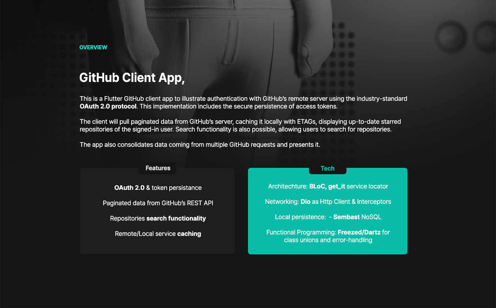
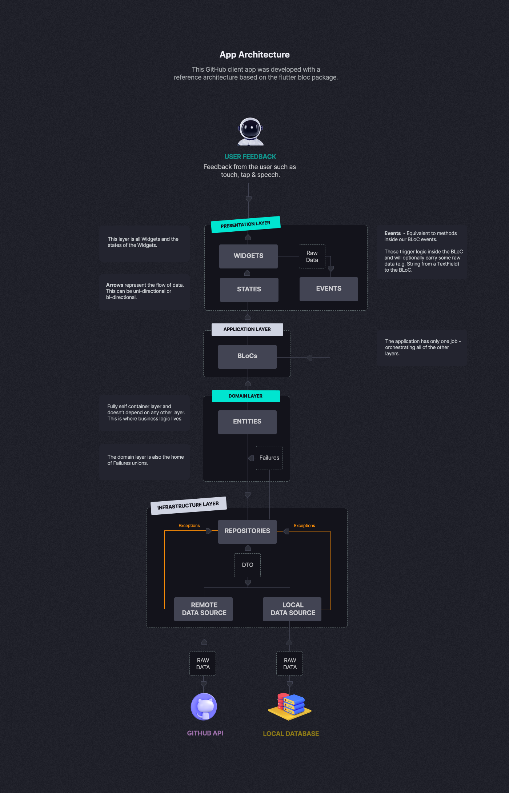
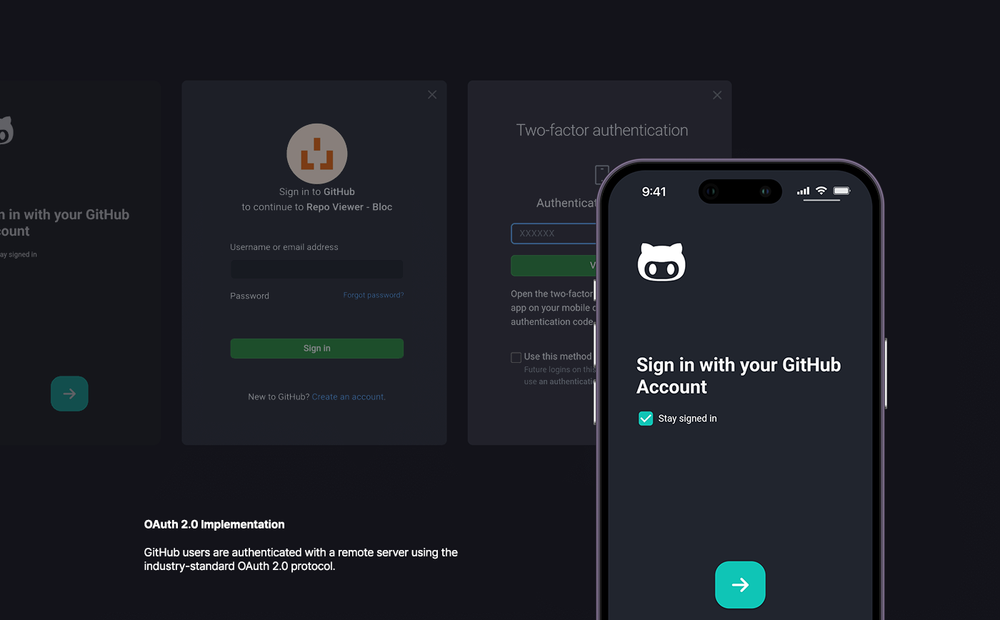
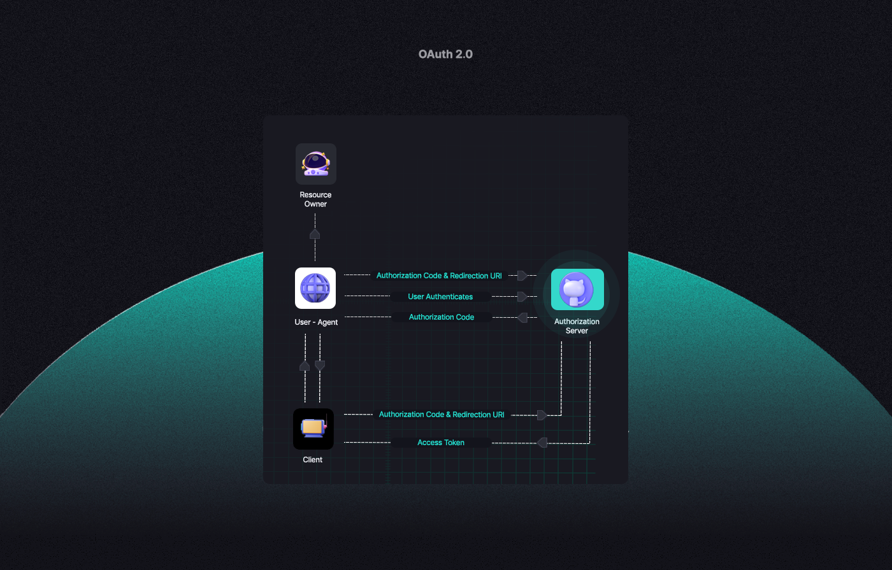
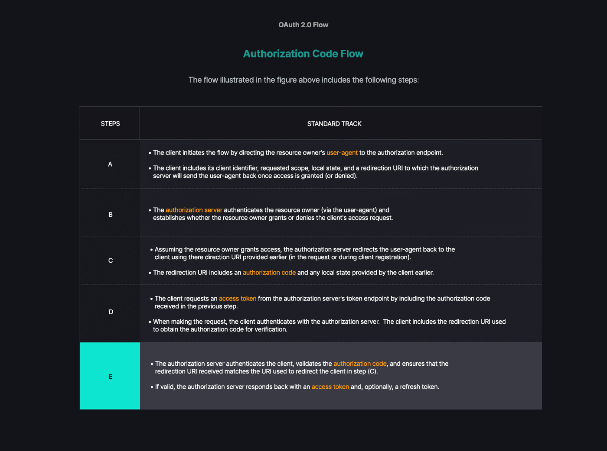
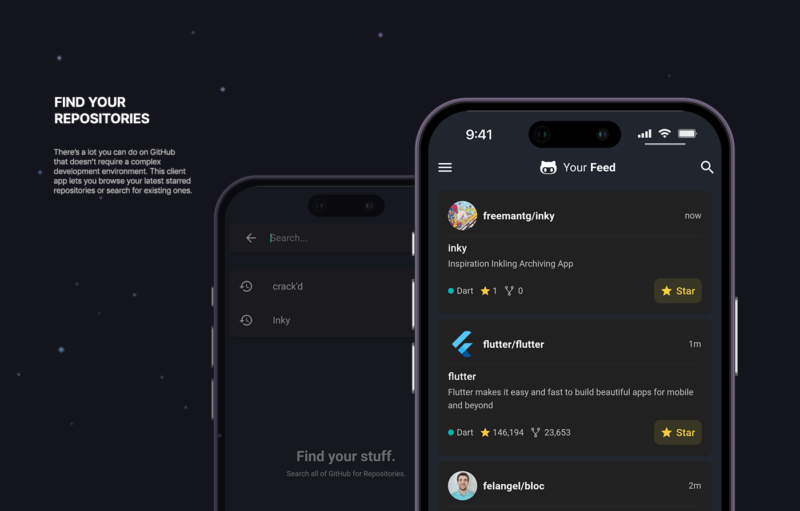

# Repo Viewer - A Flutter Project 🐙

Repo Viewer is an advanced GitHub client application that exemplifies industry-leading best practices by seamlessly integrating OAuth 2.0, ensuring a secure and streamlined user experience.

## Features 📋

### User Authentication 🔒
- Implements the industry-standard OAuth2 protocol for secure user authentication.
- Securely persists tokens using `flutter_secure_storage` to ensure the user doesn't have to sign in every time the app is launched.

### Efficient Data Fetching & Caching 🔄
- Leverages dio for network requests and implements HTTP caching with ETags to reduce bandwidth usage and improve response times.
- Fetches paginated data from the server, caches it locally with sembast, and displays it in the user interface.
- Displays the starred GitHub repositories of the signed-in user.

### Search Functionality 🔍
- Provides a sophisticated search functionality that enables the user to search for specific GitHub repositories.

### WebView Integration 🌐
- Integrates `webview_flutter` to display classic HTML content.
- Displays the README file of a GitHub repository within the application itself, ensuring a cohesive user experience.

### Code Structure & Management 🛠️
- Adopts the best practices for architecting Flutter applications.
- Employs `bloc` and `flutter_bloc` for state management, `auto_route` for routing and navigation, `dartz` for functional programming support, and `get_it` and `flutter_getit` for dependency injection.
- Utilizes `freezed`, `json_serializable` and `injectable` for code generation and `flutter_lints` and `lint` to enforce best practices and style guides.
- Employs effective code duplication removal techniques, ensuring a clean and maintainable codebase.

### Screen Shots 📱










### Getting Started 🚀

To get up and running with the project, follow these steps:

## Step 1: Clone the Repository

First, you'll need to clone the repository to your local machine. You can do this with the following command:

```
git clone https://github.com/freemantg/oauth2_flutter.git
```

## Step 2: Install the Dependencies

Navigate into the project's root directory and run the following command:

```
flutter pub get
```

This will install all the required dependencies.

## Step 3: Setting up GitHub OAuth

The Repo Viewer app uses GitHub OAuth for authentication. To make it work, you need to setup OAuth apps on your GitHub account. Follow these instructions:

1. Go to your GitHub account settings.
2. Navigate to Developer settings -> OAuth Apps.
3. Click on the 'New OAuth App' button.
4. Fill the necessary fields (Application name, Homepage URL, Application description) and set the Authorization callback URL to match the `redirectUrl` in the `GithubAuthenticator` class.
5. Click on the 'Register Application' button.

Once you've set up the OAuth app, you will get a `Client ID` and a `Client Secret`. 

## Step 4: Add your GitHub OAuth IDs

Navigate to the `GithubAuthenticator` class in the project. Replace the empty strings of `clientId` and `clientSecret` constants with your own `Client ID` and `Client Secret` respectively. Make sure not to share these values publicly.

```dart
static const clientId = '<YOUR_CLIENT_ID>';
static const clientSecret = '<YOUR_CLIENT_SECRET>';
```

## Step 5: Run the app

Ensure that an emulator is running, or your physical device is connected, then from the root of the project, run:

```
flutter run
```

That's it! Now you should be able to run the app and explore the features!


## Dependencies 📦

### Core dependencies
- [auto_route](https://pub.dev/packages/auto_route)
- [bloc](https://pub.dev/packages/bloc)
- [dio](https://pub.dev/packages/dio)
- [flutter_secure_storage](https://pub.dev/packages/flutter_secure_storage)
- [webview_flutter](https://pub.dev/packages/webview_flutter)
- [dartz](https://pub.dev/packages/dartz)
- [sembast](https://pub.dev/packages/sembast)

### Dev dependencies
- [auto_route_generator](https://pub.dev/packages/auto_route_generator)
- [build_runner](https://pub.dev/packages/build_runner)
- [flutter_lints](https://pub.dev/packages/flutter_lints)
- [freezed](https://pub.dev/packages/freezed)
- [injectable_generator](https://pub.dev/packages/injectable_generator)
- [json_serializable](https://pub.dev/packages/json_serializable)
- [lint](https://pub.dev/packages/lint)

## Contributing 🤝

We welcome contributions from the community. If you wish to contribute, please take a look at our contributing guidelines.

## License 📄

Repo Viewer is licensed under the MIT License. See `LICENSE` for more information.

## Contact 📞

If you have any questions or suggestions, please reach out to us at <contact@freemantang.dev>. We'd love to hear from you!
