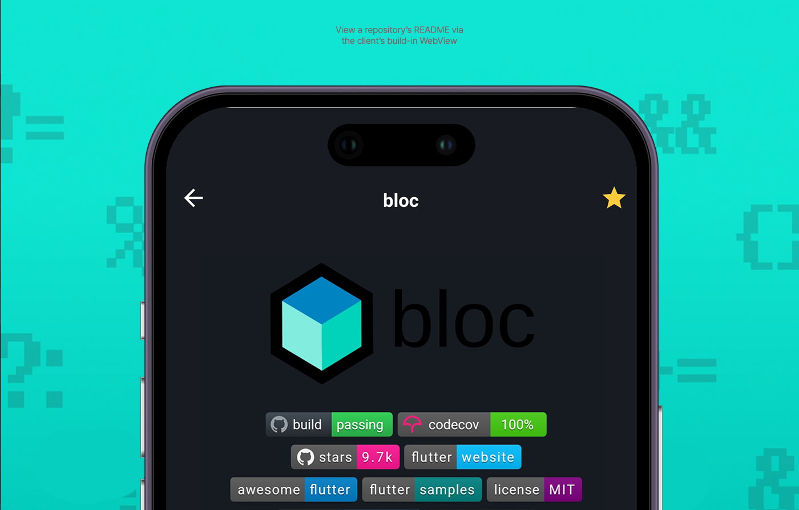

# 🐙 Repo Viewer - A Flutter Project 

Repo Viewer is an advanced GitHub client application that exemplifies industry-leading best practices by seamlessly integrating OAuth 2.0, ensuring a secure and streamlined user experience.

## Table of Contents

- [🌟 Features](#-features)
- [🏗️ Architecture](#-architecture)
- [🔧 Technical Stack](#-technical-stack)
- [🚀 Getting Started](#-getting-started)
- [🧪  Unit Testing](#-unit-testing)
- [🤝 Contributing](#-contributing)
- [📝 License](#-license)
- [📞 Contact](#-contact)

## 🌟 Features

Repo Viewer provides a host of engaging features:

- **User Authentication 🔒:** Implements OAuth2 protocol for secure user authentication and securely persists tokens.
- **Efficient Data Fetching & Caching 🔄:** Leverages dio for network requests, implements HTTP caching with ETags, fetches and caches paginated data.
- **Search Functionality 🔍:** Enables search for specific GitHub repositories.
- **WebView Integration 🌐:** Integrates `webview_flutter` to display README file of GitHub repositories.
- **Code Structure & Management 🛠️:** Adopts best practices for architecting Flutter applications.

## 🏗️ Architecture

Repo Viewer follows principles from Domain-Driven Design (DDD) and Clean Architecture, resulting in a layered architectural style:

- **Presentation:** Contains all the UI components, screens, and blocs.
- **Application:** Contains business logic that's pertinent to the application but agnostic to the domain models.
- **Domain:** Contains all the business logic that represents the 'real-world' rules. It includes business objects (models) and failures.
- **Infrastructure:** Includes the data source (APIs, local storage) and repositories. Repositories implement interfaces defined in the domain layer and return data wrapped in a Dartz `Either` type.

## 🔧 Technical Stack

Repo Viewer is crafted using the following technology stack:

### Frontend:

- **Flutter:** A UI toolkit from Google for building natively compiled applications.
- **Bloc:** A predictable state management library.
- **Dio:** A powerful Dart Http request library.
- **WebView_Flutter:** A Flutter plugin that provides a WebView widget on Android and iOS.

### Backend:

- **Sembast:** NoSQL persistent embedded file system database for Dart/Flutter.
- **Auto Route:** An easy yet powerful routing solution.
- **Dartz:** A functional programming library for Dart, used in the app for handling states and results.
- **Other Libraries:** flutter_secure_storage, freezed, json_serializable, and more.

## 🚀 Getting Started

1. Clone the repository with `git clone https://github.com/your-username/repo_viewer.git`.
2. Run `flutter packages get` in the root directory to fetch the project dependencies.
3. Setup OAuth apps on your GitHub account and replace the `clientId` and `clientSecret` constants in the `GithubAuthenticator` class with your `Client ID` and `Client Secret`.
4. Finally, execute `flutter run` to run the project on your device/emulator.

## 🧪 Unit Testing

This project places a high priority on software quality and maintainability. As a result, extensive unit testing to ensure the software's robustness and reliability, with tests covering all major components of the application is used.

The project employs the `flutter_test` package for unit and widget tests, `mockito` for creating mocks in tests, and `bloc_test` for thoroughly testing the Blocs to ensure that the app state is managed correctly.

To run the tests, simply execute the following command in the project root:

`Flutter Test`

## Contributing 🤝

We welcome contributions from the community. If you wish to contribute, please take a look at our contributing guidelines.

## License 📄

Repo Viewer is licensed under the MIT License. See `LICENSE` for more information.

## Contact 📞

If you have any questions or suggestions, please reach out to us at <contact@freemantang.dev>. We'd love to hear from you!
